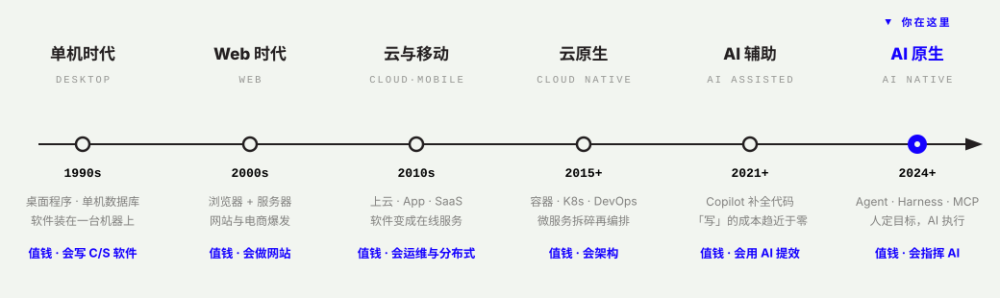

# O1 · 时代与 FDE：六次浪潮，谁值钱

> 公开课第 1 讲 · 建议 30′ · 🎬 视频位（现阶段：口播稿 + 讲解图）
> 学完你能回答：为什么写代码不值钱了？为什么企业现在要 FDE？

## 讲义

### 六次浪潮

**1990s · 单机时代** —— 软件装在一台机器上，桌面程序 + 单机数据库。值钱的人：会写 C/S（客户端/服务器）软件的工程师。那时候「会用电脑」本身就是技能。

**2000s · Web 时代** —— 浏览器 + 服务器，网站与电商爆发。软件从「装在你机器上」变成「开在浏览器里」。值钱的人：会做网站的人。

**2010s · 云与移动** —— 上云、App、SaaS。软件变成在线服务，7×24 不能挂。值钱的人：会运维、会分布式的人。

**2015+ · 云原生** —— 容器、K8s、DevOps、微服务。系统被拆碎再编排，复杂度从「写代码」转移到「设计结构」。值钱的人：会架构的人。

**2021+ · AI 辅助** —— Copilot 开始补全代码。「写」的成本第一次被机器压缩。值钱的人：会用 AI 提效的人。

**2024+ · AI 原生** —— Agent、Harness、MCP。AI 不只是补全，而是能接任务、跑流程。「写」的成本趋近于零。值钱的人：**会指挥 AI 干活的人**。

### 这条线教会我们三件事

1. **每次浪潮都重排职业价值，而不是消灭职业。** 建站的人没有消失，但「只会切图」的人消失了；这次也一样——「只会写代码」在贬值，「知道该写什么、能验收写得对不对」在升值。
2. **值钱的永远往上走一层。** 单机→写程序；Web→做网站；云→管服务；云原生→设计架构；AI 原生→定方向、做验收。离「机器能自动完成的事」越远，越安全。
3. **窗口期属于先站上去的人。** 每一波都有 3–5 年的红利窗口，给先用新方式干活的人。AI 原生这波，窗口就是现在。

### 所以，FDE 是什么

**FDE（Forward Deployed Engineer，前方部署工程师）**：被派到业务一线、对结果负责的工程师。不等需求文档，自己走进部门、看懂问题、建成系统、交付价值。

| 角色 | 干什么 | AI 时代的处境 |
|------|--------|--------------|
| 传统开发 | 按需求文档写代码，交付功能是终点 | 最先被压缩的一层 |
| AI 使用者 | 把 AI 当高级搜索引擎，问答提效 | 安全，但不建成任何东西 |
| **FDE** | 理解业务 + 指挥 AI 建成系统 + 对结果验收 | 第六次浪潮上最值钱的位置 |

在这门课里，FDE 不是头衔，是**毕业时的状态**：十天训练营答辩通过的那一刻，你就是。

## 🎬 口播稿（约 4 分钟）

> 「我先问一个问题：你有没有发现，身边『会写代码』这件事，突然不值钱了？
> 这不是你的错觉，这是三十年里的第六次。
> 九十年代，会写桌面软件的人最值钱；两千年代，会做网站的人最值钱；一零年代，会运维、会分布式的人吃香；一五年以后，会架构的人吃香。二一年，Copilot 出现了，代码开始被机器补全；二四年以后，Agent 出现了——AI 不只是补全，它能接任务、跑流程。
> 看清楚这条线：每一次浪潮，都不是某个职业消失了，而是『值钱的位置』往上挪了一层。机器能自动完成的事情越多，人就越要往上走：从写代码，到决定写什么，到验收写得对不对。
> 这就是 FDE 这个位置的来历。Forward Deployed Engineer，前方部署工程师——下到业务一线，看懂问题，指挥 AI 把系统建出来，并且对结果负责。
> 这门课不会先教你『成为 FDE』。它会带你建十天的东西，最后一天你回头看：你已经在了。」

## 自测（不用交，Day 1 快测会考）

1. 六次浪潮各自让「什么人」值钱？用一句话概括规律。
2. 为什么说「写代码不值钱」不等于「工程师不值钱」？
3. FDE 和「会用 AI 的人」差在哪？
