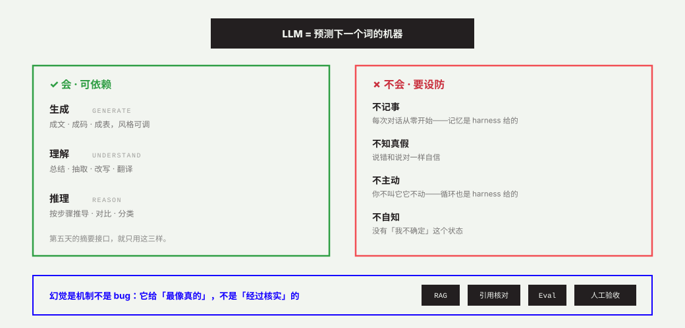

# O2 · LLM 本体：能力、边界与幻觉

> 公开课第 2 讲 · 建议 40′ · 🎬 视频位（现阶段：口播稿 + 讲解图）
> 学完你能回答：大模型会什么、不会什么？幻觉为什么不是 bug？

## 讲义

### 它到底是什么

LLM（大语言模型）= 用海量文本训练出的「预测下一个词」的机器。生成、理解、推理、翻译、总结、写代码……所有这些能力，都从这同一个机制里长出来。它不是数据库（不存事实），不是搜索引擎（不检索真相），是一台**统计上最像真的**的续写机器。

### 会什么 / 不会什么

| ✅ 会（可依赖） | ⚠️ 不会（要设防） |
|---|---|
| 生成：成文、成码、成表，风格可调 | 记忆：每次对话从零开始（除非 harness 给它记忆） |
| 理解：总结、抽取、改写、翻译 | 真相：不知道什么是「核实过」，只给「最像真的」 |
| 推理：按步骤推导、对比、分类 | 主动：你不叫它，它永远不动（Agent 的循环是 harness 给的） |
| 模仿：给定格式与范例，照做 | 自知：说错时和说对时一样自信 |

### 三个必须记住的机制

**Token 与上下文窗口。** 模型读写的单位是 token（约 0.6–1 个汉字）；上下文窗口是它「一次能看到的字数上限」。超出的部分它不是不想看，是**看不见**。Day 5 控制摘要输入长度，就是在跟窗口打交道。

**幻觉（Hallucination）。** 模型永远在给「最像真的」的答案，而不是「经过核实」的答案。冷门事实、具体数字、文献引用——它会一本正经地编。幻觉是**机制，不是 bug**：你不能修好它，只能设计流程防住它（RAG、引用核对、Eval、人工验收）。

**开源权重 vs 闭源 API。** 闭源（GPT/Claude/Gemini）只能调 API，省心但数据出门；开源权重（Qwen/DeepSeek/Llama）可下载自部署，数据不出门但要自己跑。能力、成本、隐私的三角权衡——Day 5 接电时你会做第一次选择，本课默认 Kimi 云 API。

**多模态。** 不只读写文字，还能看图、听音、出图的模型。本课只用文本能力，但你要知道这个词出现在报价单和招标书里时是什么意思。

**Fine-tuning vs Prompting。** 改模型权重（贵、慢、持久）vs 改给模型的话（快、便宜、每次重新给）。90% 的场景先用 Prompt；微调是当你有稳定范式 + 足够数据 + 预算时的后手。

### 对 FDE 意味着什么

- 把 LLM 当**能力**用（生成/理解/推理），别当**知识库**用（会编）。
- 每一次把 AI 输出交给业务前，都要过一道验收——这就是训练营天天练 Rubric 的原因。
- 「它会什么、不会什么」是你设计系统边界的第一性材料：护栏（Guardrails）、降级、人工确认点，全都从这张表里长出来。

## 🎬 口播稿（约 5 分钟）

> 「在碰任何工具之前，我们花几分钟认识一下这个时代的『电』——大语言模型。
> 它是什么？一句话：用海量文本训练出来的、预测下一个词的机器。注意，它不是数据库，它不存事实；它不是搜索引擎，它不查真相。它是一台续写机器，给你『统计上最像真的』的下文。
> 它会三件事：生成——成文成码成表；理解——总结抽取翻译；推理——按步骤推导。这三件事足够你建很多系统了。
> 但它有四件事不会，而且永远不会：它不记事——每次对话从零开始；它不知真假——说错和说对一样自信；它不主动——你不叫它，它不动；它不自知——它没有『我不确定』这个状态。
> 所以『幻觉』这个词要划重点：幻觉不是 bug，是机制。你不能修好它，你只能设计流程防住它。怎么防？检索增强、引用核对、评测集、人工验收——这门课后面全都会练到。
> 最后记住一个工程结论：把模型当能力用，别当知识库用。你设计的每一道护栏、每一个降级开关、每一个确认点，都是从『它会什么、不会什么』这张表里长出来的。」

## 自测

1. 用一句话向非技术同事解释「幻觉是机制不是 bug」。
2. 为什么「上下文窗口」会限制你把整本账甩给模型？
3. 闭源 API 和开源权重各自适合什么场景？
