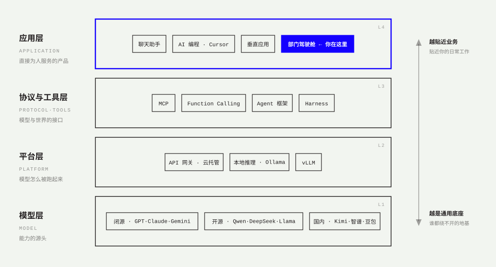

# O3 · LLM 生态：你在哪一层

> 公开课第 3 讲 · 建议 30′ · 🎬 视频位（现阶段：口播稿 + 讲解图）
> 学完你能回答：GPT / Claude / DeepSeek / Ollama / MCP / Agent 框架——各住哪一层？

## 讲义

### 四层生态，自下而上

**L1 模型层 · 能力的源头。**
闭源 API：GPT、Claude、Gemini——能力顶格，按量付费，数据出门。开源权重：Qwen、DeepSeek、Llama——可下载自部署，能力逼近闭源。国内厂商：Kimi、智谱、豆包等——合规与网络条件的默认解。选模型 = 能力、成本、隐私的三角权衡。

**L2 平台层 · 模型怎么被跑起来。**
API 网关与云托管：一个 key 调一片模型，鉴权/限流/计费都在这层。本地推理：Ollama（个人电脑跑开源模型）、vLLM（生产级推理服务）。**Day 5 你的驾驶舱就是从这一层「接电」的。**

**L3 协议与工具层 · 模型与世界的接口。**
MCP（Model Context Protocol）：给 AI 接工具/数据源的「USB-C 标准」——按标准写一个服务，所有支持 MCP 的 Agent 都能用；我们 Week2 的 Skill 就是它的朴素版。Function Calling：模型输出「调用 X、参数 Y」的结构化请求。Agent 框架与 Harness：让模型跑起循环的那副骨架。

**L4 应用层 · 直接为人服务的产品。**
聊天助手、AI 编程工具（Cursor 等）、各行各业的垂直应用——**以及你要建的部门驾驶舱**。越往上越贴近业务，越贴近你的日常工作；越往下越是通用底座，谁都绕不开。

### 怎么使用这张图

1. **听到任何新名词，先归层。** 新模型发布 → L1；新推理框架 → L2；新协议/新 Agent 工具 → L3；新应用 → L4。归完层，它八成的新闻你就看懂了。
2. **换层比换件贵。** 应用层一天能换三个工具；换模型层（比如从闭源迁到自部署）是一次架构决策。设计系统时，把「换模型」做成换网关后面的牌子，而不是动手术——Day 5 的模型网关就是干这个的。
3. **你的护城河在 L4 与业务之间。** 底座人人能买，把底座接进部门流程、做出验收的能力，买不来。

## 🎬 口播稿（约 3 分钟）

> 「GPT、Claude、DeepSeek、Ollama、MCP、LangChain、Cursor……每天冒出来的 AI 名词，其实只住在四层楼上。
> 最底下一层是模型层：能力的源头。闭源的 GPT、Claude，开源的 Qwen、DeepSeek，国内的 Kimi、智谱——选谁，是能力、成本、隐私的三角题。
> 往上一层是平台层：模型怎么被跑起来。云上的 API 网关，一个 key 调一片模型；本地的 Ollama，你自己的电脑也能跑。
> 再往上是协议与工具层：模型和真实世界之间的接口。MCP 你可以理解成 AI 界的 USB-C——按标准写一个服务，所有 Agent 都能插。
> 最上面是应用层：直接为人服务的产品。聊天助手、AI 编程工具、行业应用——还有你十天后要交付的部门驾驶舱。
> 这张图怎么用？三个用法：听到新名词先归层；记住换层比换件贵，所以把换模型设计成换牌子；最后想清楚——底座人人买得起，你的价值在应用层和业务之间。」

## 自测

1. 把 GPT / Ollama / MCP / Cursor / DeepSeek / 你的驾驶舱各归一层。
2. 为什么「换模型」应该被设计成「换网关后面的牌子」？
3. 你们部门的数据如果绝不能出内网，四层各会有什么变化？
