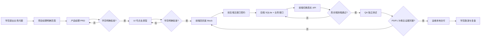

# Week 1 团队运行流程

## 一、核心原则

学员始终是团队指挥者。每个 Agent 只完成自己的岗位任务，提交、自检、等待验收，再由学员亲自 `@下一岗位`。

## 二、五天节奏

| 天 | 学员主要指挥对象 | 核心产物 | 当天不能冒充完成的内容 |
|---|---|---|---|
| Day 1 | 产品经理、UI | `docs/PRD.md` + 四页可点击原型 | 不能称为正式前端 |
| Day 2 | 前端、后端参与契约 | 四页 Mock 前端 + 五接口契约 | 不能称为数据库或真实 AI 已接入 |
| Day 3 | 后端、前端 | SQLite + 业务接口 + 真实数据联调 | 业务数据仍为 Mock 时不能进入系统测试；AI 留到 Week2 |
| Day 4 | 测试、责任开发岗位 | 测试报告 + Bug 修复复测 + 功能冻结 | 未执行的用例不能写通过 |
| Day 5 | 运维、项目经理 | README、本地交付检查、复盘路演 | 未公网部署不能称“已上线” |

## 三、状态规则

- `DRAFT`：尚未完成；
- `REVIEW`：岗位已完成实际文件和自检，等待学员验收；
- `APPROVED`：学员明确批准，Agent 仅记录该决定；
- `BLOCKED`：关键输入缺失或门禁未满足；
- `REJECTED`：学员不批准，需要定向返工；
- `RELEASED`：经授权完成真实发布；本地运行不能使用该状态。

## 四、严格禁止

- Agent 自行切换身份；
- 把下一阶段指令当作上一阶段批准；
- UI 只交文字、不交可点击原型；
- 前端仍使用 Mock 却写“联调完成”；
- 只验证接口文档一致就写“前后端全链路通过”；
- 把测试用例数量当作实际执行通过数量；
- 默认加入手机端、登录权限和 Docker；
- 把 Week 1 演示数据标成真实 AI 结果；
- 自动替学员下达下一岗位任务。

## 五、交接动作

每个岗位交付后必须停在这里：

1. 列出实际文件；
2. 列出真实执行的验证；
3. 披露假设和未完成项；
4. 状态设为 `REVIEW`；
5. 请学员验收；
6. 学员明确批准后更新状态；
7. 给出一条可复制的下一岗位提示词；
8. 停止，不执行下一岗位任务。

## 六、指挥日志（平台可评测）

每次批准或返工后，学员在工作区维护 `docs/D{N}_command_log.md`（N=当天 1–5）：

- 记录岗位、状态（`APPROVED` / `REJECTED`）、问题与目标；
- 至少一次 `REJECTED` 与一次 `APPROVED`；
- 文末学员声明：「我确认以上批准均为本人作出，Agent 未替我判定通过。」

日级 Lab 会自动检查该文件；通过后会写入能力证据「AI 团队指挥与验收」。
