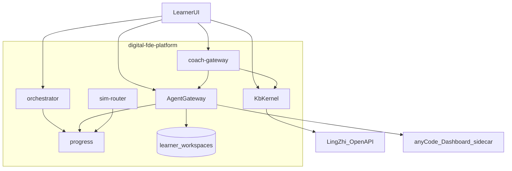
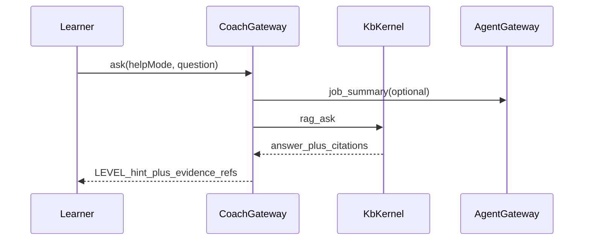

# FDE Learning OS 架构

> anyCode × 灵知 × 仿真适配 × **Agent 工作区**  
> 版本：2026-07-20 · 仓库：`digital-fde-platform` · 首期上线内核

## 1. 目标

建设 **AI 时代任务驱动型课程平台（FDE Learning OS）**：

- **灵知**提供知识卡片、课件入库与带引用 RAG（经本仓 `KbKernel` 调用）
- **anyCode**提供共享 Agent Runtime（经本仓 `AgentGateway`）；每学员隔离工作区跑长任务（如网页制作）
- **仿真适配器**保留用于命令序列 / 拓扑类 lab
- **本仓**负责训练营编排、工作区、进度证据与能力认证

硬约束：

1. 不重造 Agent loop 与 RAG 索引
2. **不**为每位学员拉起 Docker/K8s 真环境（首期）
3. Agent 长任务写文件仅限学员自己的 workspace；共享宿主机进程 + 路径沙箱
4. 仿真 lab 与 Agent lab 在任务 YAML 用 `runner: sim | agent` 区分

## 2. 底座路径（勿集成错仓）

| 名称 | 路径 | 角色 |
|------|------|------|
| 灵知 | `/Users/qingjiu/workspace/research/digital-lingzhi-platform` | 内容 / RAG |
| anyCode | `/Users/qingjiu/workspace/research/llm-cli/anycode` | Agent Runtime sidecar |
| FDE OS | 本仓 | 编排 / KbKernel / AgentGateway / 仿真 / 认证 |

说明：`research/anycode` 为口播 OPC，**不纳入本底座**。

## 3. 逻辑架构（首期）



## 4. 职责切分

### 4.1 KbKernel（内容内核模块）

- FDE 一等服务；浏览器 **不**直连灵知
- HTTP 调 Open API：`knowledge` / `rag/ask` / `rag/ask/stream` / `memories`
- **一营一 Key**（env 或 camp→key 映射）
- 卡片详情缺口：日任务 YAML `learn.steps` 兜底

详见 [kb-kernel.md](./kb-kernel.md)。

### 4.2 AgentGateway（智能执行平面）

- 共享 anyCode Dashboard sidecar（默认 `http://127.0.0.1:43180`）
- 每学员 `workspaces/{camp_id}/{learner_id}/`
- 长任务 job + SSE；并发上限每学员 1
- anyCode 不可用时：**本地 stub runner** 仍可写 HTML 产物，保证垂直切片可演示

详见 [agent-gateway.md](./agent-gateway.md)。

### 4.3 仿真平面

测验 / 命令序列 / K8s 拓扑等仍走 `SimAdapter`（见 [sim-adapters.md](./sim-adapters.md)）。

### 4.4 编排与认证

```text
Camp → DayPackage → Nodes(learn|quiz|lab|project|review|unlock)
     → Evidence → Passport
```

| 服务 | 职责 |
|------|------|
| `services/orchestrator` | 加载 YAML、节点状态机、`runner` 分流 |
| `services/kb-kernel` | 灵知封装 |
| `services/agent-gateway` | 工作区 + anyCode/stub + job/SSE |
| `services/coach-gateway` | KbKernel citations + LEVEL + job 摘要 |
| `services/sim-router` | 仿真会话 |
| `services/progress` | SQLite 证据 / Passport |
| `services/api` | 本地统一入口（挂载上述路由） |

## 5. Lab runner 约定

```yaml
lab:
  runner: agent   # 或 sim（默认 sim 若仅有 sim_kind）
  sim_kind: web_dev  # runner=sim 时必填
  agent:
    prompt_template: "在当前工作区生成库存列表页 index.html …"
  rubric:
    - check: file_exists
      args: { path: index.html }
    - check: text_contains
      args: { path: index.html, needle: "库存" }
```

## 6. AI 导师序列



## 7. 配置

| 变量 | 含义 |
|------|------|
| `LINGZHI_BASE_URL` | 默认 `http://127.0.0.1:8230` |
| `LINGZHI_API_KEY` | Open API Key；或 `LINGZHI_CAMP_KEYS=campId:key,...` |
| `ANYCODE_DASHBOARD_URL` | 默认 `http://127.0.0.1:43180`；空则 stub |
| `FDE_WORKSPACE_ROOT` | 学员目录根，默认 `./data/workspaces` |
| `FDE_DATABASE_URL` | 默认 `sqlite:///./data/fde.db` |
| `FDE_API_PORT` | 统一 API，默认 `8760` |

## 8. 证书文案

- 仿真节点：`平台仿真能力认证`
- Agent 工作区交付：`Agent 工作区交付认证`
- 复杂生产技能仍以答辩补齐

## 9. 相关文档

- [kb-kernel.md](./kb-kernel.md)
- [agent-gateway.md](./agent-gateway.md)
- [sim-adapters.md](./sim-adapters.md)
- [integration-lingzhi-anycode.md](./integration-lingzhi-anycode.md)
